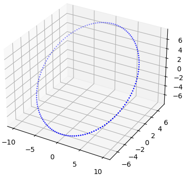
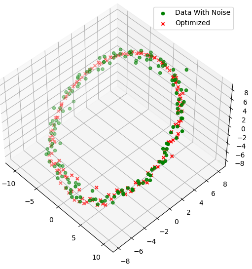

# Ceres-Solver 求解 Bundle Adjustment

## 扰动模型

> [Computing Jacobian, why error state?——优化中为何对误差状态求导 - 知乎 (zhihu.com)](https://zhuanlan.zhihu.com/p/75714471)

扰动模型的求导会比直接使用李代数求导效率高。求导的本质是自变量的微小变化导致的因变量的变化，这里是对旋转求导，但是旋转并没有加法定义，所以一种思路是转换为李代数，在李代数上推导导数。而另外一种就是给旋转一个微小变动，对于旋转也就是乘法，旋转一个微小的角度，这个角度趋于 0 时，在某个意义上也就获得了导数。但在高斯牛顿法中自变量的更新也需要变换成乘法。

也可以参考：[Modeling Non-linear Least Squares — Ceres Solver (ceres-solver.org)](http://www.ceres-solver.org/nnls_modeling.html#localparameterization)

其实就是重定义了加法操作

## 实验思路

实验主要就是参考 SLAM 14 讲，第二版 7.7、7.8 两节（看到后面发现第九章也讲了对点的优化样例，很容易拓展到多位姿模型）

作者给的是对位姿估计，但也可以同时对位姿和空间点估计。当然这会导致求解矩阵有很高的维数，所以一般利用舒尔补加速求解，可参考：[SLAM中的滑窗（Sliding window） - 知乎 (zhihu.com)](https://zhuanlan.zhihu.com/p/92100386)

因为使用扰动模型，所以需要重新配置 Ceres 的参数化 `LocalParameterization`，这里没有使用自动求导，所以需要重写 `SizedCostFunction`，舒尔补还需要对求解器做相关配置，主要涉及  `ParameterBlockOrdering`，`Options::minimizer_progress_to_stdout `推荐把 Ceres 这一部分的官方文档看一下 [Modeling Non-linear Least Squares — Ceres Solver (ceres-solver.org)](http://www.ceres-solver.org/nnls_modeling.html#) 中文也可参考：[Ceres Modeling Non-linear Least Squares - 知乎 (zhihu.com)](https://zhuanlan.zhihu.com/p/98051344)

主要类如下：

### 数据生成 DataGenerator

生成点云为倾斜的圆

```c++
class DataGenerator {
   public:
    /**
     * @brief Construct a new Data Generator object
     *
     * @param K 相机内参矩阵
     * @param T 欧式变换矩阵，即相机位姿
     */
    DataGenerator(const Eigen::Matrix3d &K, const Eigen::Matrix4d &T);

    /**
     * @brief Get the Circle3D 2D Data
     * 1. 三维空间生成倾斜的圆形，3D 数据是固定的
     * 2. 投影到相机坐标系
     *
     * @param nums 生成数据的数量
     * @param pts3d 空间点坐标
     * @param pts2d 对应的2D坐标 这里不保证都是正数
     */
    void getCircle3D_2D(int nums, Points3d &pts3d, Points2d &pts2d);

    /**
     * @brief 输出到文件
     *
     * @param filename 文件名
     * @param pts3d 三维点云
     */
    static void out2File(const char *filename, const Points3d &pts3d);

   private:
    // 相机内参矩阵
    Eigen::Matrix3d _K;
    // 相机位姿（外参）
    Eigen::Matrix4d _T;
};
```

### Ceres 求解构造

参数化：

```c++
// SE3 的参数化，可参考：https://blog.csdn.net/u012348774/article/details/84144084
class SE3LocalParameterization: public ceres::LocalParameterization {
public:
    // 扰动模型更新
    virtual bool Plus(const double* x,
                const double* delta,
                double* x_plus_delta) const;
    // 计算局部雅可比 \partial x / \partial \delta
    virtual bool ComputeJacobian(const double* x, double* jacobian) const;

    // Size of x.
    virtual int GlobalSize() const;

    // Size of delta.
    virtual int LocalSize() const;
};
```

BA 损失函数：

```cpp
class BACostFunction: public ceres::SizedCostFunction<2, 6, 3> {
public:
    BACostFunction(const Eigen::Vector2d &ui, const Eigen::Matrix3d &K);
    virtual bool Evaluate(
        double const* const* parameters,
        double* residuals,
        double** jacobians) const;
private:
    Eigen::Vector2d _ui;
    Eigen::Matrix3d _K;
};
```

BA 问题求解：

```cpp
/**
 * @brief 光束法平差求解函数
 *
 * @param se_T 相机初始位姿
 * @param pts3d 待优化点云
 * @param pts2d 对应的 2D 匹配点
 * @param K 相机内参
 * @param isSchur 是否使用舒尔补
 */
void solveBA(Vector6d& se_T, Points3d& pts3d, Points2d& pts2d,
             const Eigen::Matrix3d& K, bool isSchur = false);
```

### 可视化 data_show.py

主要用于显示优化之后的点云

## 实验结果

非线性优化初值要求很高，所以对原始数据的噪声方差都给得很小，数据点规模为 150，输出如下：

```text
File 3d_data_src.txt Open Successfully
真实位姿：
  0   0 -20   0   0   0
File 3d_data_noise.txt Open Successfully
噪声扰动后位姿：
   0.036308   -0.084019     -19.998   0.0028359  -0.0018975 -0.00088705
iter      cost      cost_change  |gradient|   |step|    tr_ratio  tr_radius  ls_iter  iter_time  total_time
   0  1.312467e-01    0.00e+00    3.40e+00   0.00e+00   0.00e+00  1.00e+04        0    9.79e-03    9.99e-03
   1  7.158516e-04    1.31e-01    1.80e+00   1.11e+01   9.95e-01  3.00e+04        1    3.06e-02    4.17e-02
   2  4.992758e-06    7.11e-04    3.87e-01   5.79e-01   9.93e-01  9.00e+04        1    2.69e-02    6.87e-02
   3  4.006820e-07    4.59e-06    1.12e-01   2.45e-02   9.20e-01  2.20e+05        1    2.72e-02    9.60e-02
   4  3.413239e-08    3.67e-07    3.29e-02   7.06e-03   9.15e-01  5.14e+05        1    2.41e-02    1.20e-01
   5  2.915494e-09    3.12e-08    9.68e-03   2.06e-03   9.15e-01  1.19e+06        1    2.13e-02    1.42e-01
   6  2.495683e-10    2.67e-09    2.85e-03   6.02e-04   9.14e-01  2.77e+06        1    2.99e-02    1.72e-01
   7  2.140092e-11    2.28e-10    8.36e-04   1.76e-04   9.14e-01  6.43e+06        1    2.31e-02    1.95e-01
   8  1.837836e-12    1.96e-11    2.46e-04   5.16e-05   9.14e-01  1.49e+07        1    2.44e-02    2.19e-01
   9  1.580162e-13    1.68e-12    7.23e-05   1.51e-05   9.14e-01  3.45e+07        1    2.41e-02    2.43e-01
  10  1.359960e-14    1.44e-13    2.12e-05   4.43e-06   9.14e-01  7.97e+07        1    2.33e-02    2.67e-01
  11  1.171389e-15    1.24e-14    6.24e-06   1.30e-06   9.14e-01  1.84e+08        1    3.22e-02    2.99e-01
Ceres Solver Report: Iterations: 12, Initial cost: 1.312467e-01, Final cost: 1.171389e-15, Termination: CONVERGENCE
优化后位姿：
  0.035581  -0.073163    -20.036  0.0019262 -0.0015654 0.00013235
File 3d_data_opt.txt Open Successfully
位姿误差：
优化前：0.091614
优化后：0.088821
点云误差
优化前：0.78033
优化后：0.59205
```

原始点云：



优化前后点云：



